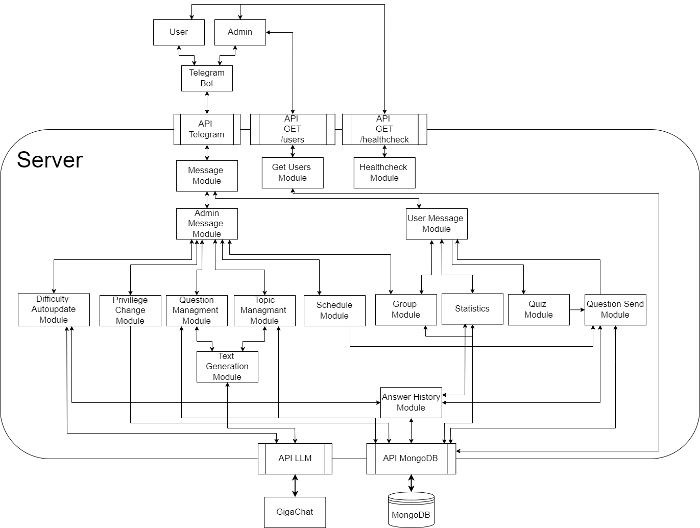
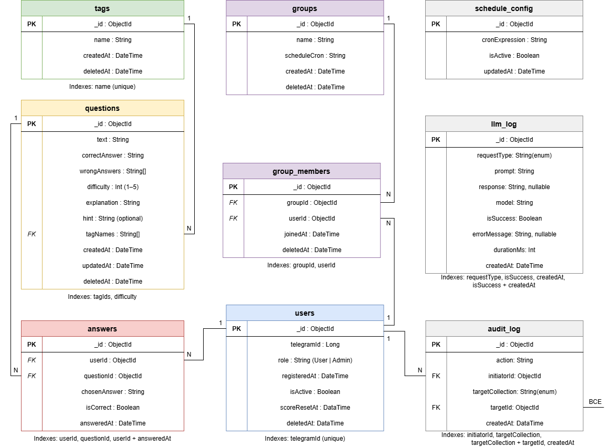

## Архитектура Quiz Bot with LLM Question Generator

### Схема

### Описание компонент
| Модуль | Назначение |
| --- | --- |
| Telegram Bot | Пользовательский интерфейс в мессенджере Telegram. Принимает команды, нажатия кнопок и передает их через HTTP на сервер приложения. |
| API Telegram | HTTP-эндпоинт, принимающий обновления от Telegram. Валидирует токен, парсит входящие данные и передает управление в Message Module. |
| API GET /healthcheck | Публичный эндпоинт для мониторинга состояния системы. Доступен без аутентификации, возвращает статус (`UP`/`DOWN`) и список авторов. |
| API GET /users | Защищенный API-ключом эндпоинт для администраторов. Возвращает список зарегистрированных пользователей с их ролями и датами регистрации. |
| Message Module | Центральный диспетчер входящих сообщений. Определяет роль отправителя и маршрутизирует запрос в Admin Message Module или User Message Module. |
| Healthcheck Module | Реализует логику эндпоинта `/healthcheck`. |
| Get Users Module | Обрабатывает запрос `GET /users`. После проверки прав администратора формирует ответ со списком пользователей из БД. |
| Admin Message Module | Маршрутизатор административных команд. Вызывает модули управления вопросами, темами, группами, расписанием и правами пользователей. |
| User Message Module | Маршрутизатор пользовательских команд. Вызывает модули викторины, статистики и управления группами при получении команд от обычного пользователя. |
| Difficulty Autoupdate Module | Анализирует историю ответов через LLM и автоматически обновляет уровни сложности вопросов в базе данных (по команде или по ежемесячному расписанию). |
| Privilege Change Module | Обрабатывает команду `\upgrade`. Позволяет администратору повышать роль пользователя с `User` до `Admin`. |
| Question Management Module | Управляет жизненным циклом вопросов: добавление (вручную или через генерацию), обновление, удаление. |
| Topic Management Module | Управление тегами/темами вопросов: создание, переименование, удаление. Проверяет уникальность и корректность названий. |
| Schedule Module | Управление автоматической отправкой вопросов. Инициирует рассылку вопросов пользователям или группам в заданное время. |
| Group Module | Управление группами: создание, приглашение участников, исключение, удаление. |
| Statistics Module | Подсчет личной и групповой статистики: общее количество вопросов, правильных/неправильных ответов, процент успеха. Фильтрация статистики по темам. |
| Quiz Module | Управление сессиями викторины. |
| Question Send Module | Форматирует и отправляет сообщения с вопросами и вариантами ответов пользователям через Telegram API. |
| Text Generation Module | Генерирует текст вопроса, ответы и подсказки при помощи LLM, отправляет запросы через API LLM, валидирует JSON-структуры ответов и обрабатывает таймауты/лимиты токенов. |
| Answer History Module | Предоставляет историю всех ответов. Предоставляет данные для фильтрации вопросов в викторине и расчета статистики. |
| API LLM | HTTP-клиент для взаимодействия с GigaChat. |
| API MongoDB | Инкапсулирует все операции с MongoDB, предоставляя репозитории для вопросов, пользователей, истории и групп. |
| GigaChat | Внешняя LLM-модель, используемая для генерации вопросов, пояснений, подсказок и анализа сложности вопросов. |
| MongoDB | Документоориентированная база данных. Хранит вопросы, темы, пользователей, историю ответов, данные групп и расписания. |

### Схема БД

### Технологический стек

* Java 25
* Spring Framework 7
* ReactiveSpring (WebFlux)
* Data MongoDB Reactive
* Spring Rest Docs
* Gradle
* MongoDB
* Docker
* Docker Compose
* Telegram API
* GigaChat
* JUnit 5